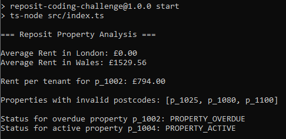
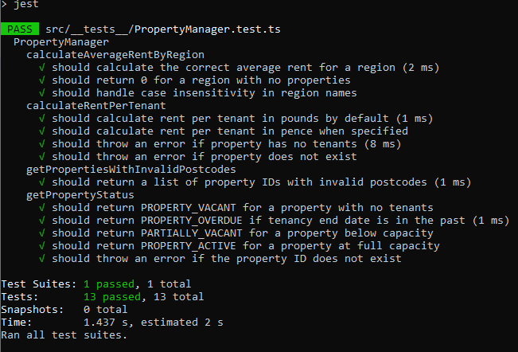

# Reposit Coding Challenge

A simple property management service built in TypeScript. This project demonstrates key backend functionality such as rent calculations, postcode validation, and property status classification using structured data and clean service design.

## Versions
- Node.js: 22.18.0
- TypeScript: 5.9.2
- Jest: 30.0.5

## Features
### Average Rent by Region
- Calculates the average rent for properties in a given region.
- Case-insensitive region lookup.

### Rent Per Tenant
- Splits the total monthly rent evenly between tenants.
- Supports currency output in pounds or pence.
- Throws an error if no tenants exist.

### Postcode Validation
- Validates UK postcodes using a strict regular expression.
- Returns a list of properties with invalid postcodes.

### Property Status
- Returns the current status of a property:
  - PROPERTY_VACANT: No tenants.
  - PARTIALLY_VACANT: Some tenants, but below capacity.
  - PROPERTY_ACTIVE: Full capacity, tenancy still valid.
  - PROPERTY_OVERDUE: Tenants present, but tenancy has expired.

## Project Structure
```
src/
├── index.ts                 # Entry point that demonstrates the service
├── types.ts                 # Type definitions for Property, Tenant, etc.
├── services/
│   └── PropertyService.ts   # Core business logic
├── utils/
│   └── DataLoader.ts        # CSV data loading utilities
└── __tests__/
    └── PropertyService.test.ts  # Unit tests
```

## How to Run
### 1. Install dependencies
```
npm install
```
### 2. Run the main script
```
npm start
```
### 3. Run the test suite
```
npm test
```

## Demo Screenshot

Here's the general application and test case output (from Jest)

### NPM start output


### Jest test case output

